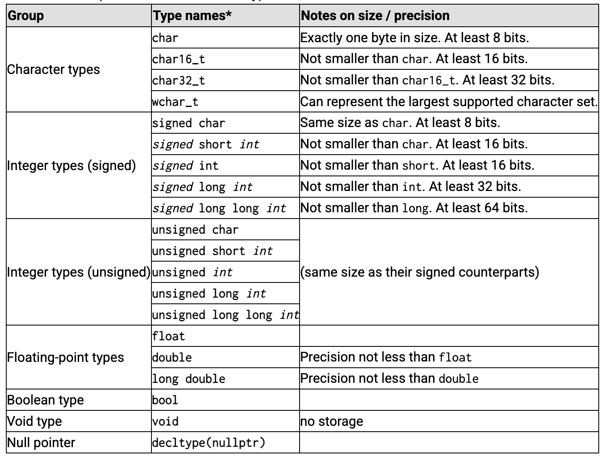

# Fundamental Values

variable: portion of memory, stores a value

valid identifier:
- starts with letter (*sometimes* underscores, not recommended)
- includes letters, digits, and/or underscores
- excludes symbols, punctuation marks, and spaces

> note: c++ is case sensitive, so "Variable," "variable," and "VaRiAbLe," are different!

### According to cplusplus.com:

the types in the same group have the same characteristics, but different sizes.

### Types

*boolean, floating-point, integer,* and *character* types are all arithmetic types.  
*void* is just the lack of a type, and *nullptr* is a pointer.  
there are *compound types*, which are based on the aforementioned 4 fundamental types. these compound types are one of c++'s strengths.
